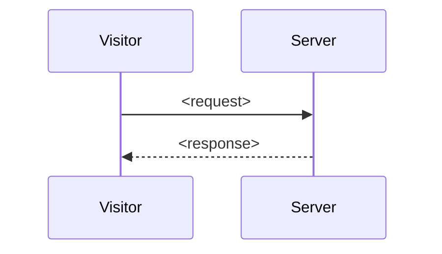

<!--
  TEMPLATE cho một Feature Spec. Copy phần dưới (bỏ khối chú thích này) vào
  docs/prd/message-hub/<feature>/PRD.md rồi điền.

  - Prose tiếng Việt, thuật ngữ kỹ thuật giữ tiếng Anh.
  - Phần B phải chính xác: file path / route / event / field verify trực tiếp với code.
  - Phần A: chỗ nào code không thể hiện lý do sản phẩm thì ghi (TODO: xác nhận với product owner).
  - ID US-n / BR-n / AC-n ổn định để plan/ticket tham chiếu chéo.
-->

---
feature: <slug-khop-ten-folder>
title: <Tên hiển thị>
domain: message-hub
category: Core             # Core | Integration | Infrastructure
status: stable             # stable | beta | unreleased
owner: <người/team hoặc TODO>
last_verified: YYYY-MM-DD  # ngày đối chiếu lần cuối với code
version: 1.0.0            # phiên bản app khi đối chiếu
modules: [src/server/<mod>, src/widget/<mod>]
entities: [<bảng>]
routes: [<METHOD /path>]
related_plans: []
related_features: [<feature-slug>]
---

# Feature Spec: <Tên tính năng>

## A. Sản phẩm

### Tổng quan

<1–2 đoạn: làm gì, cho ai, giá trị gì.>

### Quyết định sản phẩm

- <Quyết định đã chốt.> _(TODO: xác nhận nếu code không thể hiện lý do)_

### User Stories

**US-1 — <tiêu đề>:** Là <vai trò>, tôi muốn <mục tiêu> để <lợi ích>.

### Phạm vi

#### Trong phạm vi
- <...>

#### Ngoài phạm vi
- <...>

### Quy tắc nghiệp vụ

**BR-1** — <quy tắc bất biến>.

### Tiêu chí nghiệm thu

**AC-1** — <điều kiện quan sát được>.

---

## B. Tham chiếu kỹ thuật

> Mô tả **trạng thái hiện tại của code**, không phải việc cần làm. Cập nhật `last_verified` mỗi lần đối chiếu.

### Code Map

| Vai trò | File |
|---|---|
| Schema | `src/server/db/schema.ts` |
| Service | `src/server/services/<mod>.ts` |
| Route | `src/app/api/<...>/route.ts` |
| UI | `src/widget/<...>` |

### Data Model

| Trường | Kiểu | Ý nghĩa |
|---|---|---|
| `id` | `text` | Khóa chính |

### API

| Route / Event | Auth | Mô tả |
|---|---|---|
| `GET /<route>` | public / 👤 token visitor / 🔑 API key | <...> |

### Bất biến

- <Điều kiện phải luôn đúng.>

### Luồng xử lý

### Vấn đề đã biết

- <Giới hạn hoặc rủi ro còn tồn tại, kèm link plan liên quan nếu có.>

---

## Liên kết

- Thuật ngữ: `../../GLOSSARY.md`
