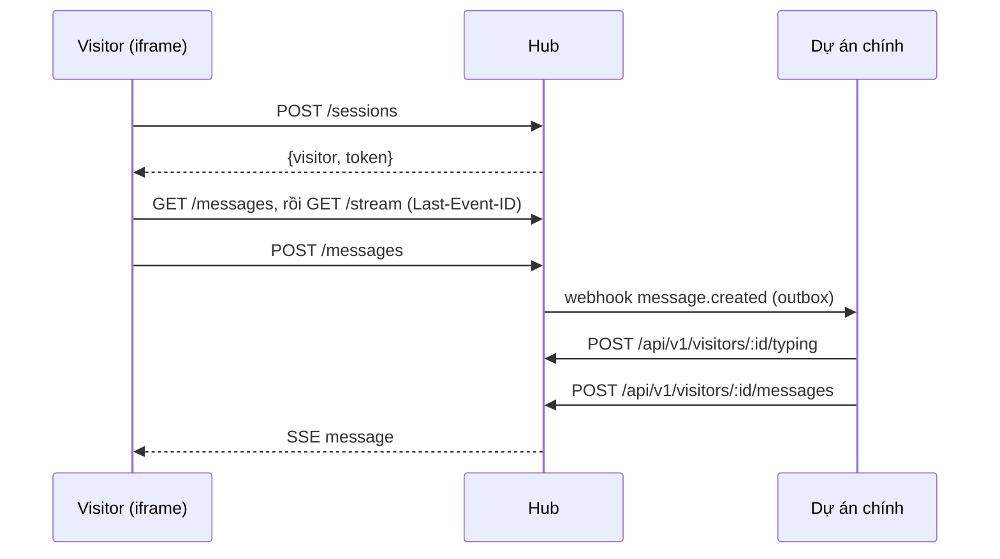

# Feature Spec: Hội thoại, realtime và UI chat

## A. Sản phẩm

### Tổng quan

Visitor chat với workspace qua widget; phía workspace (dự án chính) nhận tin bằng webhook và trả lời qua API. Tin trả lời hiện ngay trong widget qua SSE. Mỗi visitor có một hội thoại riêng trên channel; hội thoại được giữ (mặc định mãi mãi) nên visitor quay lại vẫn thấy lịch sử trên cùng trình duyệt.

### Quyết định sản phẩm

- Visitor ẩn danh; `identify(profile)` chỉ điền sẵn thông tin, **không xác minh** (định danh có chữ ký để bản sau).
- Tin nhắn là **text thuần**: tự nhận link `http(s)`, giữ xuống dòng; không markdown, không HTML.
- Visitor chỉ được tạo khi bấm "Start chat"; thoát hội thoại thu hồi token nhưng đội hỗ trợ vẫn giữ lịch sử.
- "Đang soạn" của agent không lưu DB, hiện tối đa 10 giây.

### User Stories

**US-1 — Bắt đầu:** Là visitor, tôi muốn bấm nút và gửi tin mà không phải đăng ký.

**US-2 — Trả lời realtime:** Là visitor, tôi muốn thấy câu trả lời ngay khi agent gửi, kèm tên và ảnh người trả lời.

**US-3 — Quay lại:** Là visitor, tôi muốn thấy lại cuộc trò chuyện khi mở lại trang, và tải thêm tin cũ.

**US-4 — Gửi tin đáng tin:** Là visitor, tôi muốn tin không bị trùng khi mạng chập chờn và có nút gửi lại khi lỗi.

**US-5 — Dùng bàn phím, màn hình nhỏ:** Là visitor, tôi muốn dùng hoàn toàn bằng bàn phím, ở màn hình 320 px, và đổi ngôn ngữ lúc chạy.

**US-6 — Trả lời từ dự án chính:** Là ứng dụng chính, tôi muốn gửi tin (kèm `sender`, file) và báo "đang soạn" cho visitor.

**US-7 — Biết trang visitor đang xem:** Là nhân viên, tôi muốn mỗi tin kèm URL/tiêu đề trang để hiểu ngữ cảnh.

### Phạm vi

#### Trong phạm vi
- Session, hồ sơ visitor, gửi/nhận tin, lịch sử phân trang, SSE, typing, rate limit, dọn theo retention.

#### Ngoài phạm vi
- Trạng thái đã đọc, nhiều agent, giờ làm việc/offline, markdown, tìm kiếm.

### Quy tắc nghiệp vụ

**BR-1** — Token visitor (`vt_…`, 256-bit) trả đúng một lần; DB chỉ lưu SHA-256. Mọi route `/api/widget/*` (trừ tạo session và cấu hình channel) cần token; visitor chỉ đọc/ghi hội thoại của chính mình.

**BR-2** — Tin gửi kèm `clientMessageId` là idempotent theo `(visitor, clientMessageId)`: gửi lại trả tin cũ (200), không tạo thêm, không queue thêm webhook.

**BR-3** — `text` ≤ 4000 ký tự; phải có text hoặc ít nhất một file; tối đa 10 file; body có trường lạ bị từ chối.

**BR-4** — Tin được lưu **cùng transaction** với dòng outbox webhook, rồi mới phát SSE.

**BR-5** — Rate limit: 20 tin/phút/visitor, 20 session/phút/IP (IP = hop thứ `TRUSTED_PROXIES` tính từ cuối `X-Forwarded-For`; không xác định được thì bỏ giới hạn IP, còn trần chung 300 session/phút); vượt → 429 `RATE_LIMITED` + `Retry-After`. Tối đa 5 stream đồng thời mỗi visitor.

**BR-6** — SSE: có `Last-Event-ID` thì phát lại các tin có `seq` lớn hơn (tối đa 200) rồi tiếp tục trực tiếp; thiếu hơn 200 tin thì gửi `event: resync` và client tải lại trang lịch sử mới nhất; `DELETE /api/widget/me` đóng các stream đang mở của visitor đó; ping 25 giây; `X-Accel-Buffering: no`.

**BR-7** — Hiển thị text luôn qua React text (escape) + `tokenize()`; chỉ tạo link `http(s)` (`rel="noopener noreferrer nofollow ugc"`).

**BR-8** — `visitors.lastSeenAt` cập nhật tối đa mỗi phút. `MESSAGE_RETENTION_DAYS > 0` xóa visitor không hoạt động quá hạn (kèm tin nhắn).

### Tiêu chí nghiệm thu

**AC-1** — Visitor A không đọc được tin của visitor B dù cùng channel; thiếu/sai token → 401 (`tests/widget-api.test.ts`).

**AC-2** — Reconnect với `Last-Event-ID` nhận đủ tin bị lỡ, theo thứ tự, không trùng (test + đã kiểm với `next start` thật).

**AC-3** — `` hiển thị như chữ, không thực thi (`tests/widget-logic.test.ts`, kiểm Chrome).

**AC-4** — Luồng bàn phím hoàn chỉnh (chào → form → gửi → thoát hội thoại), đổi locale lúc chạy, vừa 320 px (kiểm Chrome 2026-10-07).

---

## B. Tham chiếu kỹ thuật

### Code Map

| Vai trò | File |
|---|---|
| Schema | `src/server/db/schema.ts` (`visitors`, `messages`) |
| Services | `services/sessions.ts`, `services/messages.ts`, `services/visitors.ts` |
| Realtime | `src/server/realtime/hub.ts`, `src/app/api/widget/stream/route.ts` |
| Widget routes | `src/app/api/widget/{sessions,me,messages,stream}` |
| Admin routes | `src/app/api/v1/visitors/**` |
| Rate limit | `src/server/http/rate-limit.ts` |
| UI | `src/widget/ChatApp.tsx`, `components/`, `useSession.ts`, `useChat.ts`, `reducer.ts`, `stream.ts`, `sse.ts`, `linkify.ts` |

### Data Model

| Bảng.cột | Ý nghĩa |
|---|---|
| `visitors.id/channel_id/token_hash/locale/profile/user_agent/origin/last_seen_at` | `profile` JSON (≤ 20 khóa, giá trị chuỗi ≤ 500 hoặc số) |
| `messages.seq` | `INTEGER PRIMARY KEY AUTOINCREMENT`; cursor phân trang và SSE event id |
| `messages.id/direction/text/attachments/sender/context/client_message_id` | `direction` = `inbound` \| `outbound`; `context` = `{url,title,referrer}` (chỉ inbound); unique `(visitor_id, client_message_id)` |

### API

| Route | Auth | Mô tả |
|---|---|---|
| `POST /api/widget/sessions` | public (rate limit IP) | `{channelId, locale?, profile?, origin?}` → `{visitor, token}`; `origin` (origin của trang đang chat, do loader cung cấp) được chuẩn hóa và lưu ở `visitors.origin`, chỉ mang tính tham khảo (client tự khai) |
| `GET/PATCH/DELETE /api/widget/me` | 👤 | Đọc / sửa `profile`,`locale` / thu hồi token |
| `GET /api/widget/messages?before=&limit≤50` | 👤 | Lịch sử `{data, hasMore}` |
| `POST /api/widget/messages` | 👤 | `{text, attachments:[{fileId}], clientMessageId, context}` |
| `GET /api/widget/stream` | 👤 | SSE: `event: message` (id = seq), `event: typing`, `event: resync` |
| `GET /api/v1/visitors/[id]` | 🔑 | Chi tiết visitor |
| `GET/POST/DELETE /api/v1/visitors/[id]/messages` | 🔑 | Lịch sử / trả lời `{text, attachments, sender}` / xóa hội thoại |
| `POST /api/v1/visitors/[id]/typing` | 🔑 | `{sender?}` → phát "đang soạn" |

### Luồng xử lý

### Bất biến

- `seq` tăng đơn điệu; một tin chỉ phát SSE sau khi transaction commit.
- Hub realtime, rate limiter nằm trong bộ nhớ process → chỉ chạy một instance.

### Vấn đề đã biết

- Lịch sử hội thoại của nhiều thiết bị cho cùng một người dùng chưa hỗ trợ (cần định danh có chữ ký).
