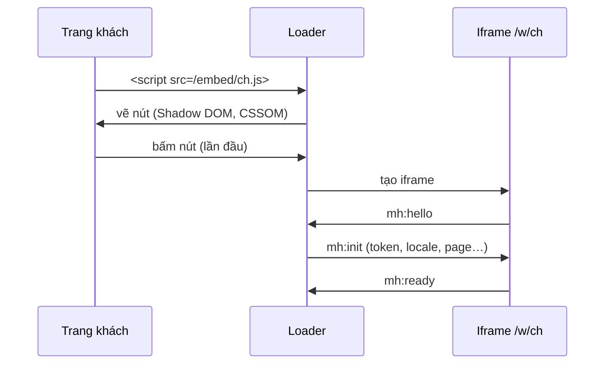

# Feature Spec: Widget loader & nhúng

## A. Sản phẩm

### Tổng quan

Website khách nhúng widget bằng **một thẻ script**: ``. Loader (~9,5 KB) vẽ nút mở chat trong Shadow DOM, tạo iframe `/w/ch_xxx` khi visitor mở chat lần đầu, và cung cấp `window.MessageHub` để site điều khiển. Trang không ai mở chat thì không tạo iframe và không ghi gì vào DB.

### Quyết định sản phẩm

- Chỉ có cách nhúng bằng thẻ script (HTML, WordPress, GTM, React qua `useEffect`); chưa có gói npm.
- Host suy ra từ `src` của script, không có biến build-time: một image chạy mọi môi trường.
- Token visitor lưu ở `localStorage` của **trang chủ** (first-party) rồi chuyển vào iframe qua `postMessage`.
- Loader không `fetch`, không thẻ `<style>`, không thuộc tính `style` dạng chuỗi → site có CSP chặt chỉ cần cho phép `script-src https://message-hub.example.com` và `frame-src https://message-hub.example.com`.

### User Stories

**US-1 — Nhúng:** Là chủ workspace, tôi muốn dán một dòng script để có chat trên website.

**US-2 — Tự làm nút mở chat:** Là lập trình viên của workspace, tôi muốn ẩn nút mặc định (`launcher.hidden`) và gọi `MessageHub.open()` từ nút của mình.

**US-3 — SPA:** Là lập trình viên React, tôi muốn `init → destroy → init` nhiều lần (StrictMode, điều hướng) mà không để rác.

**US-4 — Analytics và badge riêng:** Là lập trình viên, tôi muốn nhận sự kiện `ready | open | close | message | unread`.

**US-5 — Chặn site lạ:** Là chủ workspace, tôi muốn trình duyệt tự chặn nhúng iframe ở domain không nằm trong `allowedOrigins`.

**US-6 — Layout responsive của website:** Là lập trình viên, tôi muốn thay đổi vị trí, trạng thái hiện/ẩn và z-index của launcher tại runtime mà không cần tải lại widget.

### Phạm vi

#### Trong phạm vi
- Loader, API `window.MessageHub`, giao thức `postMessage` loader ↔ iframe, trang chat `/w/[channelId]`, `frame-ancestors`.

#### Ngoài phạm vi
- Gói npm, xác minh danh tính visitor bằng chữ ký, CSS tùy ý.

### Quy tắc nghiệp vụ

**BR-1** — Loader không gọi `fetch`/XHR; cấu hình launcher (vị trí, màu, nhãn, chuỗi `open/close` mọi locale bật) nằm sẵn trong file script (JSON đã escape `< > & U+2028/9`).

**BR-2** — Mọi kiểu của loader đặt bằng CSSOM; `:focus-visible` mô phỏng bằng listener; mobile được xác định chỉ theo chiều rộng viewport hiện tại ≤ 768 px, được tính lại khi resize và dùng bố cục toàn màn hình khi mở chat.

**BR-3** — Loader chỉ nhận `postMessage` khi `event.source` là iframe nó tạo **và** `event.origin` là host của script; luôn gửi tới đúng origin đó. Iframe khóa origin parent từ `mh:init` và chỉ gửi lại origin đó (riêng `mh:hello` đi `*` và không mang dữ liệu).

**BR-4** — `/w/[channelId]` trả `Content-Security-Policy: frame-ancestors 'self' <allowedOrigins>` (hoặc `*` khi rỗng). `?preview=1` luôn `*` vì không tạo visitor/không gửi tin.

**BR-5** — `/embed/<id>.js` có `ETag`, `Cache-Control: public, no-cache`, `nosniff`, `Cross-Origin-Resource-Policy: cross-origin`; browser/CDN được lưu response nhưng phải revalidate mỗi lần tải trang, settings đổi thì trả loader mới ngay; id lạ → 404.

**BR-6** — Iframe có `sandbox` (scripts, same-origin, forms, popups, downloads) và `title` theo ngôn ngữ.

**BR-7** — Lỗi (không xác định được host, iframe không khởi động sau 15 s) ghi rõ ra console kèm gợi ý CSP / `X-Frame-Options`.

**BR-8** — Runtime launcher API chỉ hoạt động trên instance đã khởi tạo. `setLauncherPosition()` nhận ít nhất một trong `position | x | y`, validate toàn bộ object trước khi mutate và cập nhật launcher cùng khung chat desktop; `setLauncherVisible()` chỉ ẩn/hiện button, không đóng chat; `setLauncherZIndex()` đặt z-index button và khung chat cao hơn một mức. Override không persist và reset khi `init()` lại.

### Tiêu chí nghiệm thu

**AC-1** — Trên trang có CSP `default-src 'none'; script-src hub; frame-src hub; style-src 'self'` nút hiện, mở chat, gửi tin được, 0 vi phạm (`public/csp-test.html`; đã kiểm Chrome 2026-10-07).

**AC-2** — Origin không có trong `allowedOrigins` không hiển thị được iframe (đã kiểm Chrome).

**AC-3** — `init → destroy → init` ×3 để lại đúng một widget, không rò listener (`tests/loader.test.ts`).

**AC-4** — Tin nhắn `postMessage` từ origin/window khác bị bỏ qua (`tests/loader.test.ts`).

**AC-5** — Launcher dùng cùng một `offset` ở mọi viewport; website có thể đổi vị trí, visibility và z-index tại runtime, còn chat trên mobile vẫn full viewport (`tests/loader.test.ts`).

---

## B. Tham chiếu kỹ thuật

### Code Map

| Vai trò | File |
|---|---|
| Nguồn loader | `src/loader/loader.js` → `pnpm build:loader` → `src/loader/loader.min.ts` |
| Dựng config + JSON an toàn | `src/loader/build.ts` |
| Route loader | `src/app/embed/[file]/route.ts` |
| Trang chat | `src/app/w/[channelId]/page.tsx`, `src/widget/ChatApp.tsx` |
| CSP `frame-ancestors` | `src/proxy.ts` |
| Giao thức | `src/widget/protocol.ts`, `src/widget/useHost.ts` |
| Trang thử | `public/demo.html`, `public/csp-test.html` |

### API `window.MessageHub`

Production dùng `https://message-hub.example.com` cho loader, iframe và API; file đính kèm dùng `https://files.message-hub.example.com`. Host của loader vẫn suy ra từ `src` của script, không hardcode trong code; development giữ localhost.

`init({ locale?, identify?, open? })` · `open()` · `close()` · `toggle()` · `setLauncherPosition({position?, x?, y?})` · `setLauncherVisible(boolean)` · `setLauncherZIndex(number)` · `setLocale(code|null)` · `identify(profile)` · `on(event, fn)` → hàm hủy · `off` · `destroy()`. `x/y` là integer `0–400`; z-index là integer `0–2147483647`. Các override launcher chỉ tồn tại trong instance hiện tại và reset khi gọi `init()` lại. Thuộc tính thẻ script: `data-locale`, `data-auto-init="false"`.

### Giao thức postMessage

| Hướng | Message |
|---|---|
| iframe → loader | `mh:hello`, `mh:ready`, `mh:token {token}`, `mh:unread {count}`, `mh:message {message}`, `mh:close-request`, `mh:error` |
| loader → iframe | `mh:init {token, locale, htmlLang, page, identify, open}` (đáp `mh:hello`), `mh:open {page}`, `mh:close`, `mh:locale`, `mh:identify` |
| parent → preview iframe | `mh:preview {settings, locale?, screen?}` |

### Luồng xử lý

### Vấn đề đã biết

- Ngữ cảnh trang (`context`) chỉ được làm mới khi mở chat (`mh:open`), chưa theo dõi điều hướng SPA từng bước.
- Site bật `Cross-Origin-Embedder-Policy: require-corp` hoặc Trusted Types sẽ chặn widget (giới hạn đã biết, xem research 2 §5c).
